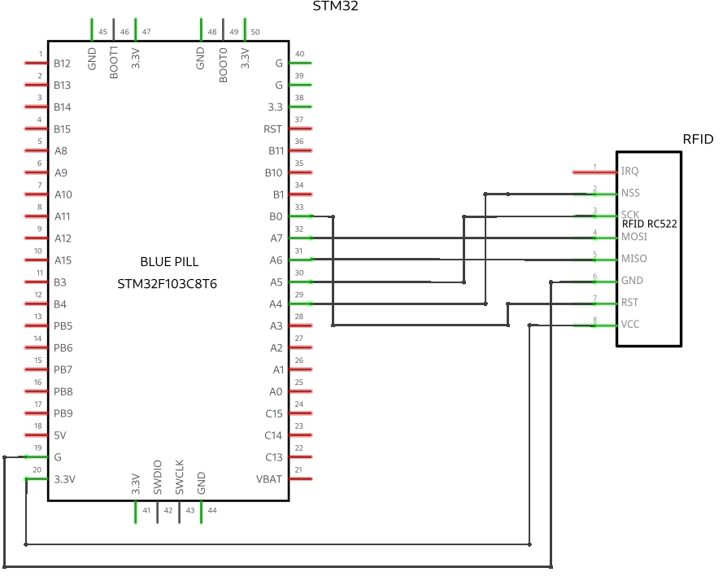

# RC522 RFID - STM32 Library
Collaborative project among students of the Microcontrollers course, aiming to create a library that abstracts the use of the RFID reader module RC522 on STM32 Blue Pill microcontrollers.

See documentation in Portuguese (Brazil) [here](README-PT.md).

## 🚀 Features
- [x] **a) Read Single Card ID (UART Output):** Function to detect and read the unique identifier (UID) of an RFID card and output the result via UART interface.
- [x] **b) Read Multiple Card IDs (UART Output):** Function to detect and read the unique identifiers of multiple RFID cards consecutively, with output of results through the UART interface.
- [x] **c) Write Content (String) to RFID Card:** Function to write a specific string to the storage of an RFID card, allowing for customization or specific use of the card.
- [x] **d) Read Content (String) from RFID Card:** Function to retrieve and read a previously stored string from an RFID card.
- [ ] **e) Active Communication - Module-to-Module Chat:** Implementation of a bidirectional communication system between multiple RFID modules, enabling real-time message exchange.
- [ ] **f) Active Communication: Module-to-Smartphone NFC:** Function that allows communication between the RFID module and an NFC-equipped smartphone, enabling direct reading and writing of data between the devices.

## 👥 Project Collaborators
Sorted alphabetically

<table>
  <tr>
    <td align="center">
      <a href="https://github.com/AndreAlves-18" title="André Alves">
        
        <br>
        <sub>
          <b>André Alves</b>
        </sub>
      </a>
    </td>
    <td align="center">
      <a href="https://github.com/Arthursnoww" title="Arthur Roberto">
        
        <br>
        <sub>
          <b>Arthur Roberto</b>
        </sub>
      </a>
    </td>
    <td align="center">
      <a href="https://github.com/CaioJ0rdan" title="Caio Jordan">
        
        <br>
        <sub>
          <b>Caio Jordan</b>
        </sub>
      </a>
    </td>
    <td align="center">
      <a href="https://github.com/calebe-sucupira" title="Calebe Sucupira">
        
        <br>
        <sub>
          <b>Calebe Sucupira</b>
        </sub>
      </a>
    </td>
    <td align="center">
      <a href="https://github.com/elitonnmelo" title="Éliton Melo">
        
        <br>
        <sub>
          <b>Éliton Melo</b>
        </sub>
      </a>
    </td>
  </tr>
  <tr>
    <td align="center">
      <a href="https://github.com/guiaf04" title="Guilherme Araújo">
        
        <br>
        <sub>
          <b>Guilherme Araújo</b>
        </sub>
      </a>
    </td>
    <td align="center">
      <a href="#" title="Jefferson Matheus">
        
        <br>
        <sub>
          <b>Jefferson Matheus</b>
        </sub>
      </a>
    </td>
    <td align="center">
      <a href="https://github.com/JosueSucupira" title="Josué Sucupira">
        
        <br>
        <sub>
          <b>Josué Sucupira</b>
        </sub>
      </a>
    </td>
    <td align="center">
      <a href="#" title="Marcos Nascimento">
        
        <br>
        <sub>
          <b>Marcos Nascimento</b>
        </sub>
      </a>
    </td>
    <td align="center">
      <a href="https://github.com/marcusnogueiraa" title="Marcus Nogueira">
        
        <br>
        <sub>
          <b>Marcus Nogueira</b>
        </sub>
      </a>
    </td>
  </tr>
  <tr>
    <td align="center">
      <a href="https://github.com/pedronobredmc" title="Pedro Nobrega">
        
        <br>
        <sub>
          <b>Pedro Nobrega</b>
        </sub>
      </a>
    </td>
    <td align="center">
      <a href="https://github.com/ryanguilherme" title="Ryan Guilherme">
        
        <br>
        <sub>
          <b>Ryan Guilherme</b>
        </sub>
      </a>
    </td>
    <td align="center">
      <a href="https://github.com/wl11lm" title="William Marreiro">
        
        <br>
        <sub>
          <b>William Marreiro</b>
        </sub>
      </a>
    </td>
  </tr>
</table>


----
# rc522-stm32-Library

This library was created to simplify communication between the STM32 microcontroller (from the STM32F103xx family) and the RC522 RFID reader using the SPI interface. Instead of handling the complexity of directly controlling the RC522, it streamlines the process, allowing the user to work with RFID cards in a practical and efficient way.

**Dependencies:**
- SPI protocol
- stdint.h library
- stm32f1xx.h library

**Current Version:** 1.0.0  
**License:** MIT License

## Installation

1. Clone the repository:
   ```bash
   git clone https://github.com/marcusnogueiraa/rc522-stm32-library
   ```

2. Add the library files to your STM32CubeIDE project.

3. Configure the SPI and GPIO pins in your `Main` according to the instructions provided in the example code.

## Connection and Schematic

### Hardware Connection

To use this library with the RC522 RFID reader on an STM32 board, you will need to make the following connections between the RC522 pins and the STM32 pins:

| RC522 Pin | Function              | STM32 Pin |
| --------- | --------------------- | --------- |
| VCC       | Power Supply 3.3V      | 3.3V      |
| GND       | Ground                 | GND       |
| RST       | Module Reset           | PB0       |
| IRQ       | Interrupt (not used)   | -         |
| MISO      | SPI Master-In Slave-Out | PA6       |
| MOSI      | SPI Master-Out Slave-In | PA7       |
| SCK       | SPI Clock              | PA5       |
| SDA (SS)  | Slave Select           | PA4       |

Configure the PA4, PA5, PA6, and PA7 pins according to the hardware connection table.

## Connection Schematic

Below is the schematic for connecting the RC522 reader to the STM32F103xx microcontroller.

(Schematic image)

## Library Structure

- `rc522.c`: Implements the main functions for using the RC522.
- `rc522.h`: Function declarations and macro definitions for the RC522.
- `timer.c`: Timer initialization and operation functions.
- `timer.h`: Timer function declarations and macro definitions.
- `uart.c`: Implements the UART interface for serial communication with the device.
- `uart.h`: UART function declarations and macro definitions.

## Usage Example

### Initialization

```c
#include <stdint.h>
#include "stm32f1xx.h"
#include "rc522.h"
#include "uart.h"
#include "string.h"

uint8_t defaultKey[6] = {0xFF, 0xFF, 0xFF, 0xFF, 0xFF, 0xFF};
uint8_t startBlock = 4;
char myString[] = "Testing 1, 2, 3... ";

void GPIO_Config() {
    RCC->APB2ENR |= RCC_APB2ENR_SPI1EN;
    RCC->APB2ENR |= RCC_APB2ENR_IOPAEN;
    RCC->APB2ENR |= RCC_APB2ENR_IOPCEN;
    RCC->APB2ENR |= RCC_APB2ENR_IOPBEN;

    // PA4- CE, PA5-SCK, PA7-MOSI, PA6-MISO:
    // PA5 SCK will be set as alternate function output push-pull
    GPIOA->CRL |= GPIO_CRL_MODE5_0 | GPIO_CRL_MODE5_1;  // Output Mode
    GPIOA->CRL |= GPIO_CRL_CNF5_1;                     // Alternate Function
    GPIOA->CRL &=  ~(GPIO_CRL_CNF5_0);
    // PA7 MOSI will be set as alternate function output push-pull
    GPIOA->CRL |= GPIO_CRL_MODE7_0 | GPIO_CRL_MODE7_1;  // Output Mode
    GPIOA->CRL |= GPIO_CRL_CNF7_1;                     // Alternate Function
    GPIOA->CRL &=  ~(GPIO_CRL_CNF7_0);
    // PA4 CE will be set as General Purpose Output Mode
    GPIOA->CRL |= GPIO_CRL_MODE4_0 | GPIO_CRL_MODE4_1;  // Output Mode
    GPIOA->CRL &= ~GPIO_CRL_CNF4_1;                     // General Purpose
    GPIOA->CRL &=  ~(GPIO_CRL_CNF4_0);
    // PA6 MISO will be set as Floating Input Mode
    GPIOA->CRL &= ~(GPIO_CRL_MODE6_0 | GPIO_CRL_MODE6_1);  // Input Mode
    GPIOA->CRL &= ~GPIO_CRL_CNF6_1;                       // Floating Input
    GPIOA->CRL |=  (GPIO_CRL_CNF6_0);
    // PC13
    GPIOC->CRH = 0xFF0FFFFF;
    GPIOC->CRH = 0x00200000;
    GPIOC->ODR &= ~(1 << 13);
    // PB0
    GPIOB->CRL = 0xFFFFFFF0;
    GPIOB->CRL = 0x00000002;
    GPIOB->ODR &= ~(1 << 0);
}

void SPI_Init() {
    GPIO_Config();
    RCC->APB2ENR |= (1 << 12);         // Enable SPI1 Clock
    SPI1->CR1 &= ~(1 << 0) | (1 << 1); // CPOL=0, CPHA=0
    SPI1->CR1 |= (1 << 2);             // Master Mode
    SPI1->CR1 |= (2 << 3);             // BR[2:0] = 010: fPCLK/8, PCLK2 = 72MHz, SPI clk = 9MHz
    SPI1->CR1 &= ~(1 << 7);            // LSBFIRST = 0, MSB first
    SPI1->CR1 |= (1 << 8) | (1 << 9);  // SSM=1, SSI=1 -> Software Slave Management
    SPI1->CR1 &= ~(1 << 10);           // RXONLY = 0, full-duplex
    SPI1->CR1 &= ~(1 << 11);           // DFF=0, 8 bit data
    SPI1->CR1 |= (1 << 6);             // SPE=1, Peripheral enabled
}

int main() {
    SPI_Init();           // Initialize SPI
    MFRC522_Init();       // Initialize the RC522 module
    USART1_Init();        // Initialize UART for debugging

    uint8_t uid[10];
    if (Read_MFRC522(uid) == MI_OK) {
        uart_write("Card UID: %s\n", uid);
    }

    return 0;
} 
```

## API Reference

### `SPI_TransmitReceive`

**Description:**  
Function used to transmit and receive data via SPI.

**Parameters:**  
- **uint8_t data**: Data to be transmitted via SPI.

**Return:**  
- **uint8_t**: Data received after transmission.

---

### `RC522_SPI_Transfer`

**Description:**  
Wrapper function for sending and receiving data via SPI.

**Parameters:**  
- **uint8_t data**: Data to be transmitted via SPI.

**Return:**  
- **uint8_t**: Data received after transmission.

---

### `Write_MFRC522`

**Description:**  
Writes a value to a specific register address in the MFRC522 module.

**Parameters:**  
- **uint8_t addr**: Register address in the MFRC522.  
- **uint8_t val**: Value to be written to the register.

**Return:**  
- **void**

---

### `Read_MFRC522`

**Description:**  
Reads a value from a specific register address in the MFRC522 module.

**Parameters:**  
- **uint8_t addr**: Register address to be read.

**Return:**  
- **uint8_t**: Value read from the register.

---

### `SetBitMask`

**Description:**  
Sets the bits of a mask in a specific register.

**Parameters:**  
- **uint8_t reg**: Register address.  
- **uint8_t mask**: Bit mask to be set.

**Return:**  
- **void**

---

### `ClearBitMask`

**Description:**  
Clears the bits of a mask in a specific register.

**Parameters:**  
- **uint8_t reg**: Register address.  
- **uint8_t mask**: Bit mask to be cleared.

**Return:**  
- **void**

---

### `AntennaOn`

**Description:**  
Activates the antenna of the MFRC522.

**Parameters:**  
- **None**

**Return:**  
- **void**

---

### `AntennaOff`

**Description:**  
Deactivates the antenna of the MFRC522.

**Parameters:**  
- **None**

**Return:**  
- **void**

---

### `MFRC522_Reset`

**Description:**  
Resets the MFRC522 module.

**Parameters:**  
- **None**

**Return:**  
- **void**

---

### `MFRC522_Init`

**Description:**  
Initializes the MFRC522 module and prepares SPI communication.

**Parameters:**  
- **None**

**Return:**  
- **void**

---

### `MFRC522_ToCard`

**Description:**  
Communicates directly with the RFID card to send commands and receive responses.

**Parameters

:**  
- **uint8_t command**: Command to be sent to the card.  
- **uint8_t* sendData**: Data to be sent to the card.  
- **uint8_t sendLen**: Length of the data to be sent.  
- **uint8_t* backData**: Buffer where the response data will be stored.  
- **uint16_t* backLen**: Length of the response received.

**Return:**  
- **uint8_t**: Operation status code.

---

### `MFRC522_Request`

**Description:**  
Requests the identification of an RFID card.

**Parameters:**  
- **uint8_t reqMode**: Request mode to identify the card type.

**Return:**  
- **uint8_t**: Operation status code.

---

### `MFRC522_Anticoll`

**Description:**  
Performs anti-collision to prevent multiple cards from responding at the same time.

**Parameters:**  
- **uint8_t* serNum**: Buffer where the card's serial number will be stored.

**Return:**  
- **uint8_t**: Operation status code.

---

### `CalculateCRC`

**Description:**  
Calculates the CRC for data to communicate with the RFID card.

**Parameters:**  
- **uint8_t* pIndata**: Data for which the CRC will be calculated.  
- **uint8_t len**: Length of the data.  
- **uint8_t* pOutData**: Buffer where the calculated CRC will be stored.

**Return:**  
- **void**

---

### `MFRC522_Write`

**Description:**  
Writes a block of data to the RFID card.

**Parameters:**  
- **uint8_t blockAddr**: Block address where the data will be written.  
- **uint8_t* writeData**: Data to be written to the card.

**Return:**  
- **uint8_t**: Operation status code.

---

### `MFRC522_Read`

**Description:**  
Reads a block of data from the RFID card.

**Parameters:**  
- **uint8_t blockAddr**: Block address to be read.  
- **uint8_t* recvData**: Buffer where the read data will be stored.

**Return:**  
- **uint8_t**: Operation status code.

---

### `MFRC522_Auth`

**Description:**  
Authenticates a block on the RFID card for reading or writing.

**Parameters:**  
- **uint8_t authMode**: Authentication mode (typically `PICC_AUTHENT1A`).  
- **uint8_t blockAddr**: Block address to be authenticated.  
- **uint8_t* key**: Authentication key.  
- **uint8_t* serNum**: Card serial number.

**Return:**  
- **uint8_t**: Operation status code.

---

### `MFRC522_SelectTag`

**Description:**  
Selects the RFID card based on the serial number.

**Parameters:**  
- **uint8_t* serNum**: Serial number of the card to be selected.

**Return:**  
- **uint8_t**: Operation status code.

---

### `MFRC522_Halt`

**Description:**  
Puts the RFID card in a Halt (stop) state.

**Parameters:**  
- **None**

**Return:**  
- **void**

---

### `Read_Single_Card`

**Description:**  
Reads a single RFID card, authenticating and reading the data block.

**Parameters:**  
- **uint8_t* serNum**: Buffer where the card's serial number will be stored.  
- **uint8_t* recvData**: Buffer where the read data will be stored.

**Return:**  
- **uint8_t**: Operation status code.

---

### `Read_Multiple_Cards`

**Description:**  
Reads multiple RFID cards, one at a time, authenticating and reading data from each card found.

**Parameters:**  
- **uint8_t* serNum**: Buffer where the card's serial number will be stored.  
- **uint8_t* recvData**: Buffer where the read data from each card will be stored.

**Return:**  
- **uint8_t**: Operation status code.

---

### `Write_Content_Card`

**Description:**  
Writes custom content to a block of the RFID card after authentication.

**Parameters:**  
- **uint8_t blockAddr**: Block address where the data will be written.  
- **uint8_t* writeData**: Buffer containing the data to be written to the card.  
- **uint8_t* serNum**: Serial number of the card to be written.  
- **uint8_t* key**: Authentication key.

**Return:**  
- **uint8_t**: Operation status code.

---

### `Read_Content_Card`

**Description:**  
Reads the content of a block from the RFID card after authentication.

**Parameters:**  
- **uint8_t blockAddr**: Block address to be read.  
- **uint8_t* recvData**: Buffer where the read data will be stored.  
- **uint8_t* serNum**: Serial number of the card to be read.  
- **uint8_t* key**: Authentication key.

**Return:**  
- **uint8_t**: Operation status code.

## Schematic


## Error Handling

### Common Errors

- **MI_OK**: Operation completed successfully.
- **MI_ERR**: Communication error with the RFID card. Check the SPI connections.
- **MI_NOTAGERR**: No card detected. Ensure the card is within the reading range.

## Contribution

Feel free to submit pull requests or open issues for any improvements or fixes needed for better library functionality.


